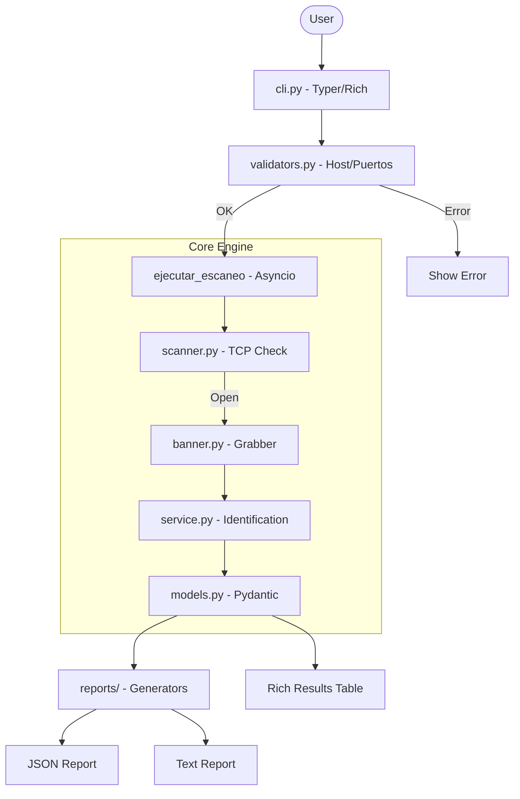

# Recon-Tool: High-Performance Asynchronous Network Reconnaissance

An asynchronous port scanner and service discovery utility built to demonstrate high-concurrency I/O and security-first development practices. It provides lightning-fast reconnaissance with robust input validation and professional CLI reporting.

## 🌟 About the Developer
Hello! I'm **Ezequiel Ranieri**. I am a self-taught developer who discovered the world of programming through curiosity and a passion for building things. Everything I know—from architecture patterns to distributed systems—I've learned on my own through books, technical documentation, videos, and endless hours of practice.

I created this project to consolidate and demonstrate my understanding of software development. I don't claim to be a senior architect; I am a dedicated learner who enjoys solving complex technical challenges and building robust software that works under pressure.

**Contact:**
- **Email:** ez.ranieri@gmail.com
- **GitHub:** https://github.com/ezequielranieri
- **LinkedIn:** https://www.linkedin.com/in/ezequielranieri/

---

## 🎯 Why this project?
I built this tool to explore the limits of Python's `asyncio` ecosystem when handling massive network I/O. My goal was to create a reconnaissance utility that wasn't just fast, but also "safe" by design—implementing strict RFC compliance to prevent accidental scanning of internal or reserved networks. I wanted to move beyond simple socket checks and dive into service identification heuristics and secure banner grabbing.

## 🏗 System Architecture / Data Flow
My project follows a modular pipeline designed for scalability and clear separation of concerns:

1.  **Input Validation**: The CLI parses target hosts and port ranges, enforcing security boundaries to block reserved IP ranges.
2.  **Concurrency Control**: I use an asynchronous semaphore to limit the number of simultaneous workers, preventing resource exhaustion.
3.  **Async Scanning**: The engine performs non-blocking TCP connection attempts to determine port states (open, closed, or filtered).
4.  **Banner Acquisition**: For open ports, I trigger a sanitized read operation to capture service banners without risking terminal injection.
5.  **Heuristic Identification**: The system cross-references port numbers and banner signatures to identify the running services.
6.  **Structured Reporting**: Data is collected into Pydantic models and exported to either formatted terminal tables or persistent files (JSON/TXT).



## 🛠 Tech Stack
- **Python 3.12+**: The core language utilizing the latest type-hinting features.
- **Asyncio**: The engine driving high-concurrency network operations.
- **Typer**: Used for building the professional CLI interface and command parsing.
- **Rich**: Handles the terminal UI, including progress bars, panels, and stylized tables.
- **Pydantic v2**: Ensures data integrity through strict schema validation and serialization.
- **Pytest-Asyncio**: My choice for testing the asynchronous network logic.

---

## 🚀 Quick Start Guide
### Prerequisites
- Python 3.12 or higher installed.

### Installation
1. Clone the repository and navigate to the directory:
   ```bash
   git clone https://github.com/ezequielranieri/recon-tool.git
   cd recon-tool
   ```
2. Install the package in editable mode:
   ```bash
   pip install -e .
   ```
3. (Optional) Install development tools for testing:
   ```bash
   pip install -e ".[dev]"
   ```

---

## 💡 Usage / Endpoints
The tool is executed as a Python module. Use the `scan` command to start a reconnaissance task.

- **Basic Scan (Top 1000 ports)**:
  ```bash
  python -m recon scan google.com
  ```
- **Specific Ports and Ranges**:
  ```bash
  python -m recon scan 1.1.1.1 --ports 22,80,443,1000-2000
  ```
- **Performance Tuning**:
  Adjust workers and timeouts for faster (but more aggressive) scanning:
  ```bash
  python -m recon scan scanme.nmap.org --workers 500 --timeout 0.5
  ```
- **Exporting Results**:
  ```bash
  python -m recon scan example.com -o results.json -f json
  ```

---

## 🧠 What I Learned
Developing this project taught me the nuances of asynchronous network programming, particularly how to handle timeouts and connection errors gracefully without crashing the entire loop. I also learned the importance of sanitizing untrusted data (banners) before displaying it to the user.

### Retrospective & Technical Critique
Looking back at the code today, I noticed several areas where my current knowledge would improve the design:
*   **Unused Components**: I found a `RateLimiter` class that was implemented but never actually integrated into the scanner. This is a classic case of "over-engineering" a feature before it's needed.
*   **Inefficient Regex Handling**: In `validators.py`, I'm compiling a complex hostname regex inside the validation function. Today, I would move that to a module-level constant to avoid the overhead of re-compilation on every call.
*   **Hardcoded Signatures**: The service identification logic relies on a simple dictionary and a few `if` statements. This isn't scalable. I would refactor this into a plugin-based system or a signature file (like YAML) to allow users to add new protocols without touching the core code.
*   **Heavy Socket Handling**: I'm using `asyncio.open_connection`, which is great for high-level tasks but overkill for simple port checks. If I were to rebuild this now, I would use raw `socket.connect_ex` wrapped in `loop.run_in_executor` or lower-level transport protocols for a pure SYN scan, which would be significantly lighter on system resources.

## 🗺 Roadmap
- **Plugin System**: Externalize service signatures into a separate configuration file.
- **UDP Support**: Implement asynchronous UDP scanning (which is trickier due to its stateless nature).
- **Subdomain Enumeration**: Add a new command to find subdomains before scanning ports.

Thank you for checking out my work! I'm always open to feedback and looking for new opportunities to learn and grow.
